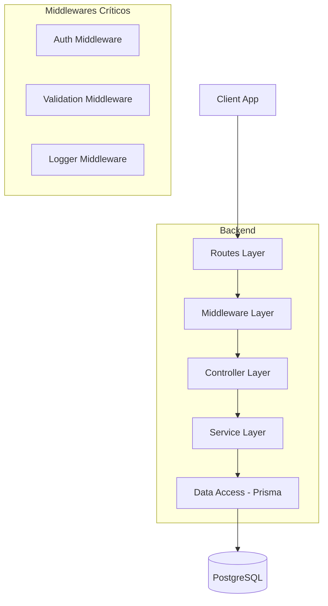
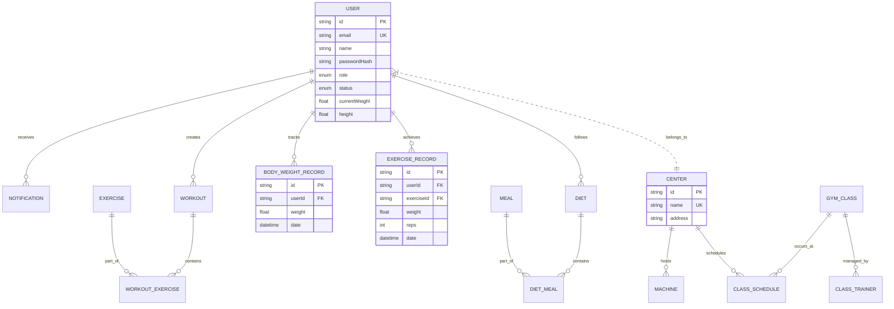

# Arquitectura del Sistema - Meta-Force Backend

Este documento detalla la arquitectura técnica, el modelo de datos y los flujos lógicos del backend de Meta-Force.

## 🛠️ Stack Tecnológico

| Componente | Tecnología | Propósito |
| :--- | :--- | :--- |
| **Runtime** | Node.js (v20+) | Entorno de ejecución de JavaScript |
| **Lenguaje** | TypeScript | Tipado estático y robustez del código |
| **Framework** | Express.js | Desarrollo de la API RESTful |
| **BBDD ORM** | Prisma | Gestión de base de datos PostgreSQL |
| **Auth** | JWT & Bcrypt | Seguridad, sesiones y hashing |
| **Validación** | Zod | Esquemas de validación de datos en runtime |
| **Logging** | Winston | Sistema de logs estructurado |
| **Documentación** | Swagger / OpenAPI | Documentación interactiva de la API |

---

## 🏗️ Arquitectura de Capas

El sistema sigue un patrón de diseño modular y por capas para asegurar la escalabilidad y el mantenimiento.

---

## 📊 Modelo de Datos (ERD)

A continuación se muestra la estructura simplificada de las entidades principales y sus relaciones.

---

## 🔐 Flujo de Autenticación y Seguridad

El sistema utiliza un flujo basado en **Bearer Tokens** (JWT) para la comunicación segura entre el cliente y el servidor.

1.  **Registro/Login**: El usuario envía sus credenciales.
2.  **Validación**: El servicio verifica los datos (o los crea) y hashea la contraseña con Bcrypt.
3.  **Emisión**: Se genera un JWT firmado con una clave secreta (TTL: 7 días).
4.  **Middleware Auth**: Intercepta las rutas protegidas, valida el token y añade el objeto `user` a la `Request` de Express.

---

## 🚀 Módulos Principales

### Auth
Gestiona el ciclo de vida de la sesión, desde el registro inicial hasta el login y la gestión de tokens.

### Users
Administra los perfiles, niveles de actividad, objetivos físicos y roles (Admin, Trainer, User).

### Performance
Módulo especializado en el seguimiento de métricas.
- **Body Weight**: Registro histórico del peso para generar gráficas de evolución.
- **Exercise Records**: Seguimiento de marcas personales (PR) en ejercicios específicos.

### Gym Management
Gestiona Centros, Máquinas y Clases grupales, permitiendo la asignación de usuarios y entrenadores.

---

## 📝 Convenciones de Código

- **Nomenclatura**: CamelCase para variables y funciones, PascalCase para clases y modelos.
- **Manejo de Errores**: Uso de bloques try-catch en controladores con logging centralizado vía Winston.
- **Validación**: Todos los cuerpos de peticiones POST/PATCH deben ser validados con esquemas Zod antes de llegar al servicio.
