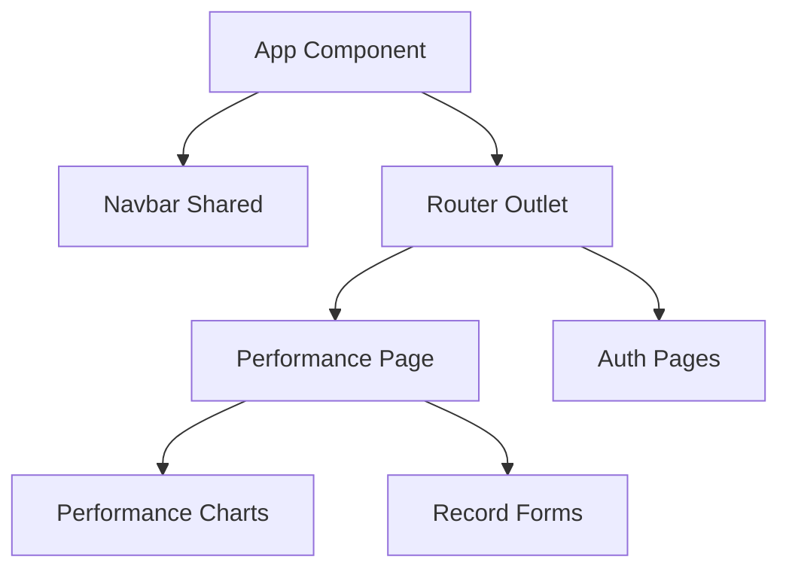

# Arquitectura del Frontend - Meta-Force

Documentación de la estructura, componentes y flujo de datos de la aplicación cliente (Angular).

## 🧰 Stack Tecnológico

- **Framework**: Angular v17+ (Componentes Standalone)
- **Estilos**: Tailwind CSS (Utilidades first)
- **Visualización**: Charts.js + ng2-charts
- **i18n**: @ngx-translate/core
- **Comunicación**: HttpClient (RxJS Observables)

## 🏗️ Estructura de Componentes

La aplicación utiliza componentes Standalone para minimizar la sobrecarga de módulos y mejorar el Lazy Loading.

## 🔐 Gestión de Estado y Autenticación

1. **Auth Service**: Gestiona el token JWT en `localStorage`.
2. **Interceptors**: Adjuntan automáticamente el header `Authorization` a las peticiones salientes hacia la API.
3. **Guards**: Protegen las rutas internas asegurando que solo usuarios con rol activo (`ACTIVE`) puedan visualizar su rendimiento.

## 📊 Visualización de Rendimiento

El módulo de Performance utiliza un patrón de **Servicio-Componente**:
- El servicio (`PerformanceService`) se encarga de las llamadas CRUD al backend local.
- El componente gestiona el estado de las gráficas y los formularios de entrada.
- Se utiliza **ng2-charts** para renderizar la evolución de peso y récords de fuerza en tiempo real.
